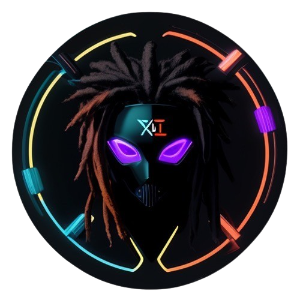

---
---

  
  <h1 style="text-align: right;">Xaiko Visuals</h1>

## Table of Contents
- [🙋 Bio](#-bio)
  - [🙋 Bio for Press](#-bio-for-press)
- [🛠️ Requirements](#️-requirements)
  - [Security Requirements](#security-requirements)
  - [Technical Requirements](#technical-requirements)
  - [Space Requirements](#space-requirements)
  - [Ambient Lighting](#ambient-lighting)
- [⚙️ Gear and Software](#️-gear-and-software)
    - [Main Hardware](#main-hardware)
    - [Controllers and Audio Input](#controllers-and-audio-input)
    - [Projectors](#projectors)
    - [Additional Equipment](#additional-equipment)
    - [Software](#software)
- [🎨 Type of Animation](#-type-of-animation)
- [⏱️ Session Details](#️-session-details)
- [🏨 Accommodations](#-accommodations)
- [💸 Fee Structure](#-fee-structure)
  - [⚠️ Important Info](#️-important-info)
  - [💸 Fee pricing structure](#-fee-pricing-structure)
- [📱 Social Media](#-social-media)
- [Samples](#samples)
- [📅 Past Events and Performances](#-past-events-and-performances)
  - [Dragoste Si Pasi](#dragoste-si-pasi)
  - [Back to Top](#back-to-top)

## 🙋 Bio

  
  

    Lucian, also known as Xaiko Visuals, is a leading AI developer and visual artist based in Sibiu, Romania. With over five years of experience in Resolume and expertise in Stable Diffusion and Large Language Models, Lucian skillfully combines his professional work experience with his personal passion for visual storytelling and music. As Xaiko Visuals, he creates immersive visual experiences for music festivals and events, producing unique visual narratives that captivate and engage audiences.
  

### 🙋 Bio for Press
Xaiko Visuals crafts immersive visual experiences that drives the public into a realm of dark and captivating aesthetics. With a focus on enriching the sensory experience, Xaiko's performances are known for their profound impact, drawing viewers into a deeply engaging visual journey.

## 🛠️ Requirements

### Security Requirements
#### ❗ Organizers are responsable for ensuring the safety and security of the equipment and personal bags at all times while at the venue. A secure space must be provided for the storage of equipment and performance safeguarded against unauthorised access, theft, personal or enviromental damage.
#### ⚠️ Failure to meet the specified security requirements will result in reimbursement to the artist for any damages, loss, or theft incurred during the performance.

### Technical Requirements
- **Power Needs**: Minimum of 800W to 1.5KW for equipment and projectors.
- **Waterproofing**: Cable ramps required for outdoor events to protect cables.
- **Power Access**:
  - **Indoor**: Close access to electrical outlets.
  - **Outdoor**: Power cables should be provided near the equipment setup area.

### Space Requirements
- **Outdoor Events**: Space for a 3x3 Pavilion or Backstage indoor setup.
- **Indoor Events**: Space for a 2x1 Table / provided table for Equipment.
- **Cable Management**: specific arrangements discussed based on venue, refer to Power Access.

### Ambient Lighting
- **Maximum Ambient Light**:
  - **Indoor**: Preferably controlled lighting conditions to enhance visual impact.
  - **Outdoor**: Performances best held during night to utilize projector capabilities fully.

## ⚙️ Gear and Software

#### Main Hardware
- **Laptop for Visual Mapping**: GP65-Leopard-9SX-GTX
- **Content Creation**: Offsite Cloud Runpods with RTX 4090Ti
- **On-Site Quick Diffusions**: Dell Precision 5560

#### Controllers and Audio Input
- **MIDI Controller**: Akai APC40 MKII
- **Audio Interface**: Focusrite i2i

#### Projectors
- **Main Projector**: BenQ MH733 1080p, 4000 ANSI lumens
- **Secondary Projectors**: Minimum 1080p/4k, 3000 ANSI lumens; rented or venue-provided

#### Additional Equipment
- **Cameras**: Phone cameras, GoPro cameras for dynamic recording angles
- **Router**: For internet and managing network infrastructure

#### Software
- **Visual Design and Performance**: Touch Designer, Resolume Arena/Alley
- **AI and Generative Content**: Stable Diffusion
- **Streaming and Recording**: OBS for live performance and social media broadcasting

## 🎨 Type of Animation
- **3D Mapping**: Projecting visuals that align with the physical space.
- **Generative Visuals**: Real-time visuals generated through code.
- **Pre-rendered Clips**: High-definition clips created in advance.

## ⏱️ Session Details
- **Length**: Up to 12 hrs/Day
  - For Outdoor: Sunset -> Sunrise
  - For Indoor: Up to 12 hrs/Day
- **Content Type**:
  - **Original**: All visuals are created by me for unique experiences.
  - **Copied**: Incorporating popular visual themes with a unique twist.
  - **Real-Time Creation**: Visuals created on-the-fly, responding to the music and audience interaction.

## 🏨 Accommodations

- **Lodging**: Near the venue or transportation provided by the organiser.
- **Bar Protocol**: Minimum consumption agreed in advance.
- **Travel**: Transport cost from Sibiu and back, either reimbursed for fuel or a vehicle provided by the organiser.

## 💸 Fee Structure

### ⚠️ Important Info

#### Pricing follows the structure outlined below.
#### A 50% deposit is required to secure the booking, with the remaining 50% due before the performance.
#### Additional negotiations with the organizer can be applied!

### 💸 Fee pricing structure

- **Base Fee**: €100 for up to 6 hours/day; €200 for 6-12 hours/day.
- **Original Content**: €30 per hour of original content diffusion 
- **Additional Projectors**: €80 for each extra projector.
- **Large Venues/Festivals**: Prices are adjusted based on size of the event

## 📱 Social Media
- **Facebook**: [@xaiko.visuals](https://www.facebook.com/Xaiko.Visuals)
- **Instagram**:
  - For visual arts: [@xaiko.visuals](https://www.instagram.com/xaiko.visuals)
  - For inquiries: [@laMinimale](https://www.instagram.com/laminimalee/)

## Samples

<video width="320" height="240" controls loop>
  <source src="https://github.com/LucianPetri/XaikoVisuals/raw/main/Branding/Promo%20Valentines.mp4" type="video/mp4">
  Your browser does not support the video tag.
</video>
<video width="320" height="240" controls loop>
  <source src="https://github.com/LucianPetri/XaikoVisuals/raw/main/Branding/New%20promo%20Xaiko%20Visuals.mp4" type="video/mp4">
  Your browser does not support the video tag.
</video>
<video width="320" height="240" controls loop>
  <source src="https://github.com/LucianPetri/XaikoVisuals/raw/main/Branding/Samples/Robots.mp4" type="video/mp4">
  Your browser does not support the video tag.
</video>
<video width="320" height="240" controls loop>
  <source src="https://github.com/LucianPetri/XaikoVisuals/raw/main/Branding/Samples/Melting.mp4" type="video/mp4">
  Your browser does not support the video tag.
</video>
<video width="320" height="240" controls loop>
  <source src="https://github.com/LucianPetri/XaikoVisuals/raw/main/Branding/Samples/Mountain.mp4" type="video/mp4">
  Your browser does not support the video tag.
</video>
<video width="320" height="240" controls loop>
  <source src="https://github.com/LucianPetri/XaikoVisuals/raw/main/Branding/Samples/Halloween%20Spiders.mp4" type="video/mp4">
  Your browser does not support the video tag.
</video>
<video width="320" height="240" controls loop>
  <source src="https://github.com/LucianPetri/XaikoVisuals/raw/main/Branding/Samples/Opal.mp4" type="video/mp4">
  Your browser does not support the video tag.
</video>
<video width="320" height="240" controls loop>
  <source src="https://github.com/LucianPetri/XaikoVisuals/raw/main/Branding/Samples/Fractal.mp4" type="video/mp4">
  Your browser does not support the video tag.
</video>

## 📅 Past Events and Performances
### Dragoste Si Pasi
- **Location**: Near Sibiu
- **Date**: Valentines 2024
 -    

### [Back to Top](#top)
